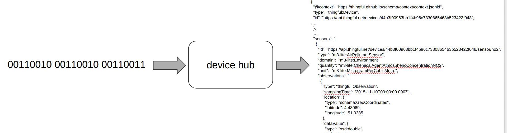

device-hub
-----------

Transforms output from one or many IOT devices via one or many protocols into a common semantically understood format.
The logic to transform the data is via a "device profile". Device profiles are written in java-script.



License
-------

Copyright © 2017 thingful

Released under the terms of "DECODE Accepted Software License"

Introduction
------------

device-hub is operated by installing a set of configured listeners, endpoint and device profiles.

device-hub is configured via the device-hub-cli.

device-hub stores its running configuration in a local boltdb database.

device-hub can run in insecure mode or using TLS in a mutual authentication model. See [security.md]( docs/security.md ) for details

Supported message formats

Transport               | Notes
------------------------|----------------------------------------------------------------
`CSV`                   |
`JSON`                  |
`RAW BYTES`             |

Supported listener transports

Transport               | Notes
------------------------|----------------------------------------------------------------
`HTTP`                  |
`MQTT`                  |

Supported endpoints

Transport               | Notes
------------------------|----------------------------------------------------------------
`STDOUT`                |

Example configuration files are in ./test-configurations/

The entity connecting a listener to a device profile and then an endpoint is called a 'pipe'.

On startup device-hub will restart all existing pipes.

Build
-----

Install golang, docker (if you want to run the integration tests or test with a local mqtt server)

Get the code -

```
go get github.com/thingful/device-hub

```

Run the tests

```
make test
```

Build executables for all platforms

```
make all
```

Output is built to ./tmp/build/

Run
---

Start the device-hub

```
./device-hub-linux-amd64
```

Configure with the cli
To import a folder of configuration files

```
./device-hub-cli-linux-amd64 create -d=./test-configurations/
```

Files can also be imported on an individual basis

```
./device-hub-cli-linux-amd64 create -f=./test-configurations/mqtt_listener.yaml
./device-hub-cli-linux-amd64 create -f=./test-configurations/std_out_endpoint.yaml
./device-hub-cli-linux-amd64 create -f=./test-configurations/profile_script.yaml
./device-hub-cli-linux-amd64 create -f=./test-configurations/profile_script_transform.yaml
```

The configuration can be inspected

```
./device-hub-cli-linux-amd64 get all
```

Create some 'pipes' that listen via http on uri /a and /b and output to std output

```
./device-hub-cli-linux-amd64 start -e={stdout endpoint uid} -l={http listenener uid} -u=/a thingful/device-1
./device-hub-cli-linux-amd64 start -e={stdout endpoint uid} -l={http listenener uid} -u=/b thingful/device-2
```

Send some messages 

```
curl -X POST -d '{"my-value": true}' 0.0.0.0:8085/a
curl -X POST -d '{"value": "22", "deviceId": "23", "createdAt": "1488205809000"}' 0.0.0.0:8085/b
```

Pipe through from MQTT -

Start the MQTT server

```
docker-compose up
```

```
./device-hub-cli-linux-amd64 start -e=mVZY2J0 -l=pjV4jN2 -u=/some-mqtt-uri thingful/device-2
```

Send a message via mqtt to 0.0.0.0:1883 e.g. using MQTTLens (https://chrome.google.com/webstore/detail/mqttlens/hemojaaeigabkbcookmlgmdigohjobjm?hl=en)
